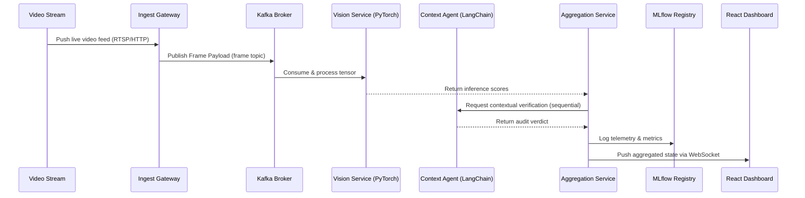

# System Flow and Sequence

## 1. High-Level Architecture

## 2. Ingest Gateway

The Ingest Gateway is the entry point for all video data into the system.

- **Input:** Live video feed over RTSP or HTTP.
- **Responsibility:** Decode the stream, extract discrete frames at the configured FPS, encode each frame as a JPEG, and publish a `FramePayload` message to the Kafka `frames` topic.
- **Throughput control:** Dynamically downsamples from 30 FPS to 5 FPS when downstream processing lag is detected.

## 3. Execution Flow

1. External source pushes a live video feed to the Ingest Gateway.
2. Gateway chunks video into discrete frames and publishes them to the Kafka `frames` topic.
3. Vision Service consumes the frame, runs MTCNN alignment, and executes the dual-branch model.
4. Vision Service result is forwarded **sequentially** to the Aggregation Service.
5. Aggregation Service calls the RAG Context Agent to verify the vision result against known threat signatures.
6. Aggregation Service merges the vision score and contextual verdict into a single `AggregatedResult` payload.
7. Telemetry data (latency, scores, drift flag) is pushed to the MLflow server.
8. Aggregated payload is broadcast over WebSockets to the React frontend.
9. Zustand updates UI state, rendering real-time graphs and compliance alerts.

> **Architecture note:** Vision and RAG run **sequentially** — RAG receives the Vision score as input context, enabling the audit to be conditioned on the model's output. This is intentional; concurrent execution would prevent the RAG agent from using the vision score in its retrieval query.

## 4. Aggregation Service

The Aggregation Service is a lightweight Python service responsible for:

- Receiving the `VisionResult` from the Vision Service.
- Calling the RAG Context Agent with the vision score as additional context.
- Merging both results into an `AggregatedResult` payload.
- Emitting telemetry to MLflow and the WebSocket broadcast.
- Applying the RAG fallback: if the RAG service exceeds **150ms**, the aggregation resolves using the Vision score alone with `verdict: "UNKNOWN"`.

## 5. Conditional Branching & Future States

- **WebSocket Disconnect:** Zustand freezes current state and initiates exponential backoff reconnection, displaying a "Stale Data" warning banner.
- **Drift Detection:** If MLflow detects the moving average of confidence scores drops below 60% for real images, the current model weights are flagged for retraining.
- **RAG Timeout:** If the RAG service exceeds 150ms, Aggregation Service resolves with Vision score only (`verdict: "UNKNOWN"`) to stay within the 200ms end-to-end SLA.
- **Future State:** Migrate aggregation logic to Apache Flink for windowed stream processing and temporal analysis.
