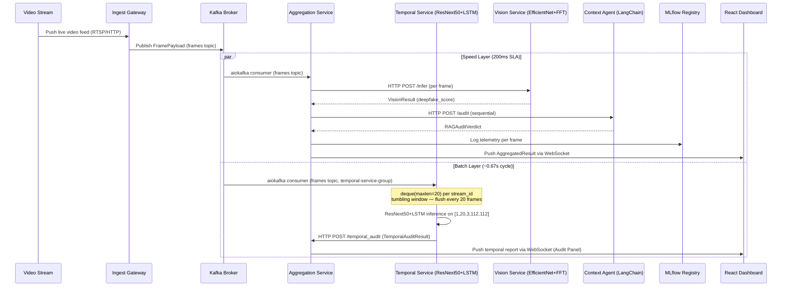

# System Flow and Sequence

## 1. High-Level Architecture

## 2. Ingest Gateway

The Ingest Gateway is the entry point for all video data into the system.

- **Input:** Live video feed over RTSP or HTTP.
- **Responsibility:** Decode the stream, extract discrete frames at the configured FPS, encode each frame as a JPEG, and publish a `FramePayload` message to the Kafka `frames` topic.
- **Throughput control:** Dynamically downsamples from 30 FPS to 5 FPS when downstream processing lag is detected.

## 3. Execution Flow

**Speed Layer (per frame, 200ms SLA):**

1. External source pushes a live video feed to the Ingest Gateway.
2. Gateway chunks video into discrete frames and publishes `FramePayload` to the Kafka `frames` topic.
3. Aggregation Service aiokafka consumer receives the frame and calls Vision Service via `HTTP POST /infer`.
4. Vision Service runs MTCNN alignment and EfficientNet-B4 + FFT dual-branch model, returns `VisionResult`.
5. Aggregation Service calls RAG Context Agent sequentially with the vision score.
6. Aggregation merges vision score and RAG verdict into a single `AggregatedResult`.
7. Telemetry (latency, scores, drift flag) pushed to MLflow.
8. `AggregatedResult` broadcast over WebSocket to React frontend (Live Ticker panel).
9. Zustand updates UI state, rendering real-time graphs and compliance alerts.

**Batch Layer (every ~0.67s / 20 frames):**

1. Temporal Service aiokafka consumer (consumer group `temporal-service-group`) independently receives the same `FramePayload` from the `frames` topic.
2. Each JPEG decoded to 112×112 RGB, ImageNet-normalised, appended to a `deque(maxlen=20)` keyed by `stream_id`.
3. When deque reaches 20 frames, tensor `[1, 20, 3, 112, 112]` is built and passed to ResNext50+LSTM.
4. `temporal_score = F.softmax(logits, dim=1)[0][0].item()` (fake class probability).
5. `TemporalAuditResult` POSTed to Aggregation Service `POST /temporal_audit`.
6. Aggregation forwards result to WebSocket broadcast (Dashboard Audit Panel). Deque is cleared (tumbling window).

> **Architecture note:** Speed and Batch layers run in parallel as independent aiokafka consumer tasks. Vision and RAG run **sequentially** within the Speed Layer — RAG must complete within **100ms** to stay inside the 200ms end-to-end SLA.

## 4. Aggregation Service

The Aggregation Service is a lightweight Python service responsible for:

- Receiving the `VisionResult` from the Vision Service.
- Calling the RAG Context Agent with the vision score as additional context.
- Merging both results into an `AggregatedResult` payload.
- Emitting telemetry to MLflow and the WebSocket broadcast.
- Applying the RAG fallback: if the RAG service exceeds **100ms**, the aggregation resolves using the Vision score alone with `audit_verdict: "UNKNOWN"`.

## 5. Conditional Branching & Future States

- **WebSocket Disconnect:** Zustand freezes current state and initiates exponential backoff reconnection, displaying a "Stale Data" warning banner.
- **Drift Detection:** If the rolling average `deepfake_score` over the last 100 frames drops below 60% on frames with a confirmed real ground-truth label (see `TRD.md §4.4`), the model is flagged for retraining.
- **RAG Timeout:** If the RAG service exceeds 100ms, Aggregation Service resolves with Vision score only (`audit_verdict: "UNKNOWN"`) to stay within the 200ms end-to-end SLA.
- **Future State:** Migrate aggregation logic to Apache Flink for windowed stream processing and temporal analysis.
