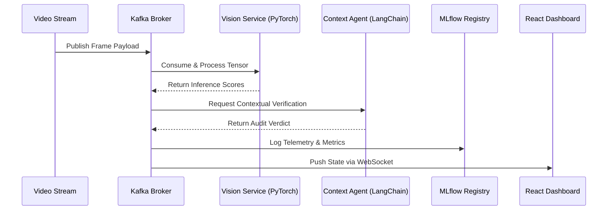

# System Flow and Sequence

## 1. High-Level Architecture

## 2. Execution Flow

1. External source pushes a live video feed to the ingest gateway.
2. Gateway chunks video into discrete frames and publishes them to the Kafka topic.
3. Vision Service consumes the frame, runs alignment, and executes the dual-branch model.
4. Stream metadata is passed concurrently to the RAG service to check against known threat signatures.
5. Aggregation script combines the vision score and contextual verdict.
6. Telemetry data (latency, scores, drift) is pushed to the MLflow server.
7. Aggregated payload is broadcasted over WebSockets to the React frontend.
8. Zustand updates UI state, rendering real-time graphs and compliance alerts.

## 3. Conditional Branching & Future States

- **WebSocket Disconnect:** Zustand freezes current state and initiates exponential backoff reconnection, displaying a "Stale Data" warning banner.
- **Drift Detection:** If MLflow detects the moving average of confidence scores drops below 60% for real images, the current model weights are flagged for retraining.
- **Future State:** Migrate aggregation logic to Apache Flink for windowed stream processing and temporal analysis.
